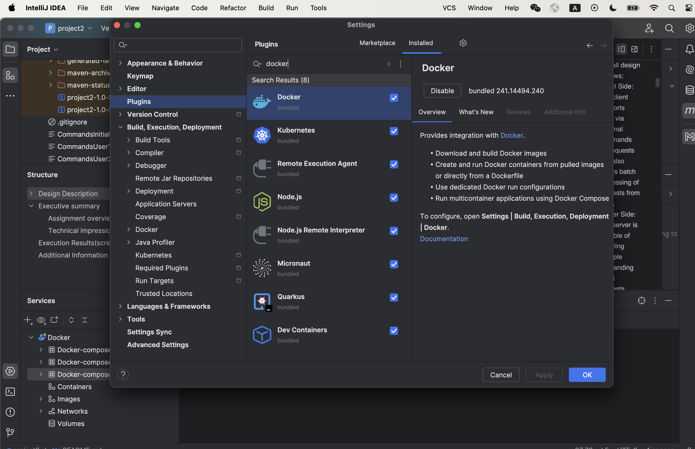
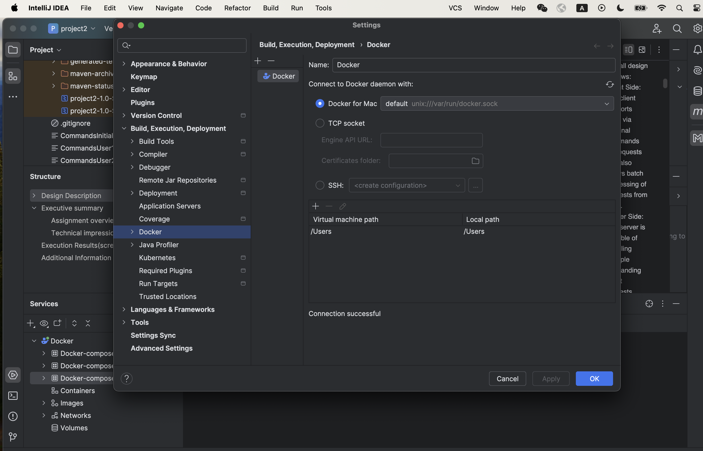
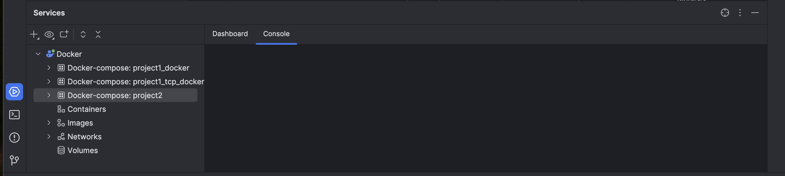
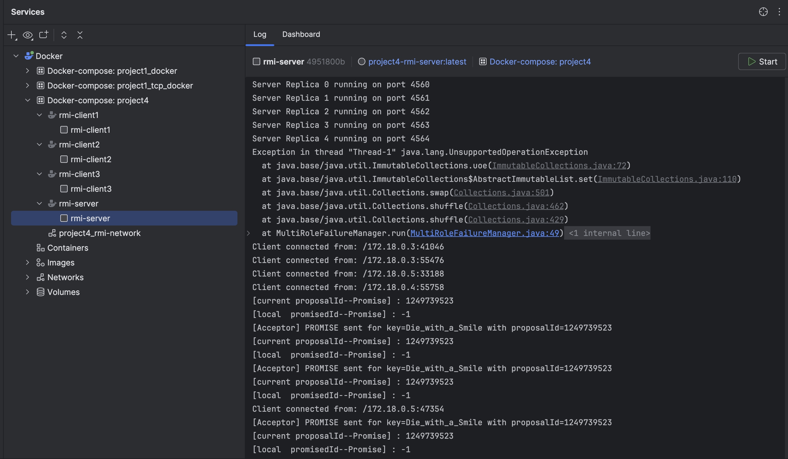
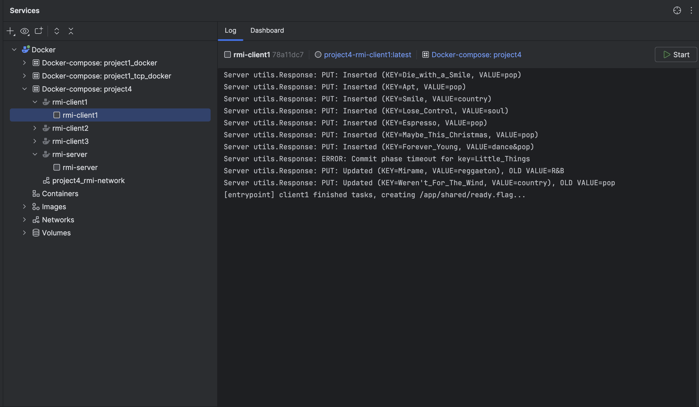
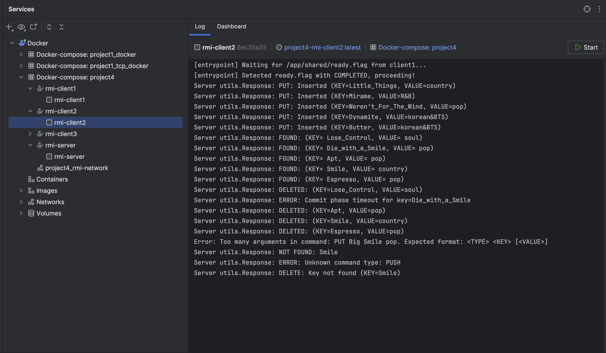
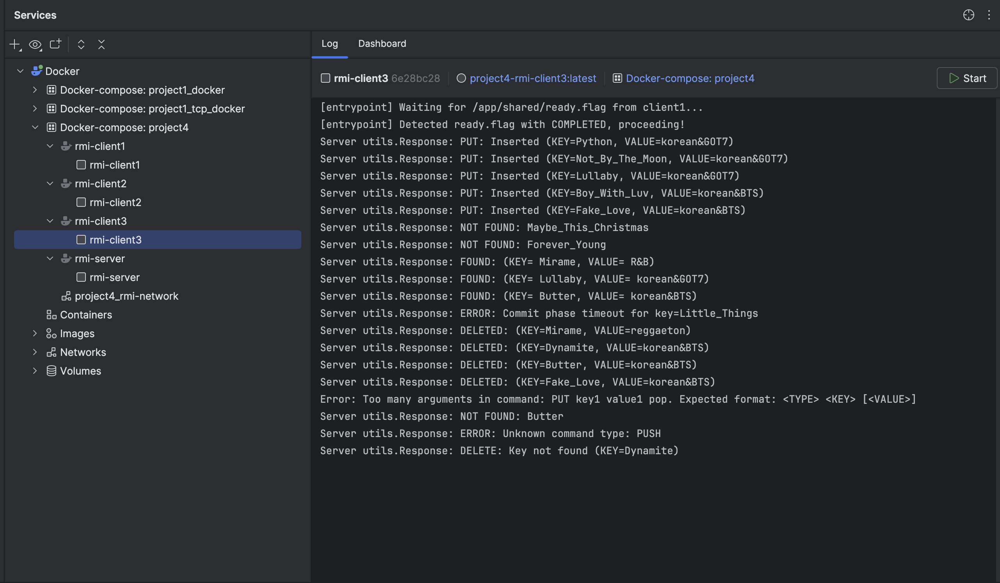

Multi-threaded Key-Value Store Server using RPC with PAXOS
by linpiao

Design Description
----------
I have implemented a distributed key-value store using Java RMI, with XML-based message serialization between clients and servers. 
To facilitate deployment, I have containerized both the server and clients using Docker. The solution evolved through multiple phases, 
progressively introducing fault tolerance and distributed consensus.

In Project 4, the main progress is Paxos Integration for Fault Tolerance.
- Added Paxos to provide fault tolerance and ensure consensus across replicas under failure conditions.
- Paxos Roles Implemented 
  + Proposer : 
    +  Initiates Paxos rounds whenever a state-changing operation (PUT or DELETE) occurs.
    +  Sends PREPARE and ACCEPT messages to Acceptors and coordinates the consensus process.
  + Acceptor:
    +  Participates in Paxos rounds by receiving PREPARE/ACCEPT requests and replying with PROMISE/ACCEPTED messages.
  + Learner:
    + Observes ACCEPTED messages and applies the committed changes once quorum is reached.
  + Commit Flow:
     Client-> Replica-> Proposer-> Acceptor-> Learner-> Replica Commit-> Proposer -> Server-> Client 
- Failure Simulation Framework
  + Single-role failure injection: This is handled using the RoleFailureManager, which is a generic class capable of managing failures for individual Paxos roles. The behavior is customized via the RoleType parameter (PROPOSER, ACCEPTOR, or LEARNER) to apply role-specific crash strategies. For example, in the RMIServer, we can test failures for Acceptors alone by using:
  <pre> 
  RoleFailureManager<Acceptor> acceptorFailureManager = new RoleFailureManager<> (acceptorStubs, RoleFailureManager.RoleType.ACCEPTOR);
  new Thread(acceptorFailureManager).start();
  </pre>
  + Multi-role failure injection: This is implemented using the MultiRoleFailureManager. In this mode, the system periodically (every 5-10 seconds) attempts to crash Proposers, Acceptors, and the Learner concurrently.
    To simulate real-world conditions, the Learner crashes with a probability of 10%, the Acceptor with 50%, and the Proposer with 70%, reflecting the Learner's relative stability compared to the other roles in the Paxos system.
  

- Technology Stack
  + Java RMI for distributed object communication
  + XML for request/response serialization
  + Docker for containerized deployment of clients and servers
  + Paxos for achieving consensus of updates amongst
    replicated state
  
Dependent Installation
---------- 

- How to install XML dependencies:
    + add the dependency in pom.xml file, see details in the file
    + click the small icon to lode maven changes

- How to install docker:
    + download the docker desktop and install from: https://www.docker.com/products/docker-desktop/
    + install docker plugin:
      see, 
        + Open IntelliJ settings (Settings).
        + Navigate to Plugins.
        + Search for "Docker" and install the plugin.
    + Connect to the Docker daemon
        + Open settings and check Build, Execution, Deployment | Docker. see,
          
        + Click The Add button to add a Docker configuration.
        + Open the Services tool window, to see Docker icon there. see,
          

Execution
----------

#### Preparation

- create Command files under the dir: project4, details about the Commands files see additional
  information.
- create Docker and logs dir
- create Dockerfiles for client and server in the Docker dir, see details in DockerfileClient and
  DockerfileServer
- create entrypoint.sh under the dir: project4 for making sure client2 and client3 depending on client1 to finish
- create docker-compose.yml under the dir: project4 for running server and client
    + server and each client run in its container
    + rmi-client1 run first using any port
    + rmi-client2 and rmi-client3 run concurrently, both depend on rmi-client1 to finish (initialize the
   key-value hashmap), both choose port randomlly

#### Compile and Build (in terminal)

- docker-compose build --no-cache

#### Run server and client (in terminal)

- docker-compose up

#### Results

- Log files are saved under the dir: projects4/logs
    + in docker-compose.yml, volumes arguments works this purpose
    + each server port has its own server log file, named: ServerLog1.txt, ServerLog2.txt,
      ServerLog3.txt, ServerLog4.txt, ServerLog5.txt (also included proposer and acceptor and all crash logs)
    + Learner log is saved in CentralizedLearnerLog.txt
    + each client logs saved in each client log file, named: ClientLog1.txt, ClientLog2.txt,
      ClientLog3.txt

      
Executive summary
----------
#### Assignment overview
The objective of this project is to enhance the fault tolerance of a distributed Key-Value Store by integrating the Paxos consensus protocol in place of the non-fault-tolerant 2PC used in Project 3. By implementing Paxos, the system ensures that replicated servers can reach consensus on updates even when some nodes fail. I designed and implemented the three key Paxos roles — Proposer, Acceptor, and Learner — as separate components that coordinate to maintain system consistency and availability under failure conditions. This assignment deepened my understanding of how Paxos achieves fault tolerance through the collaboration of these roles, ensuring that state-changing operations (PUT, DELETE) are consistently applied across all replicas.

#### Technical impression
During the implementation process, the key challenge was understanding the differences between 2PC and Paxos, and identifying which new classes needed to be added to replace 2PC with the Paxos consensus protocol. Specifically, to ensure that PUT and DELETE operations achieve a final commit through Paxos, I introduced components such as Proposer, Acceptor, and Learner. The Proposer is responsible for initiating Paxos rounds whenever a state-changing operation occurs, while the Acceptor handles PREPARE and ACCEPT messages from Proposers. The Learner observes ACCEPTED messages and, once a quorum of Acceptors agrees on a value, the Learner commits the value.

I found that these classes shared structural similarities, making their implementation relatively straightforward. However, one challenging aspect was ensuring that after a successful commit, the Learner would send the commit result back to the Proposer, which would then notify the client of the outcome. The design decision I faced was whether to use a proposerCommitQueue or introduce a Commit message type to propagate commit results. After testing both approaches, I ultimately chose to implement a dedicated Commit message. This experience helped me gain a deeper understanding of the end-to-end process of integrating Paxos — from the client request, to server-side consensus, and finally back to the client response.

Additionally, I implemented a random failure simulation framework to stress-test the Paxos protocol. For example, my ProposerFailureManager periodically crashes and restarts non-leader Proposers while ensuring that the leader Proposer remains available, thereby maintaining system progress. The manager uses random intervals to select and kill Proposer threads, simulating real-world instability, and then safely restarts them after a delay. This experience strengthened my skills in designing fault-injection mechanisms and writing resilient, thread-based distributed system components.
Execution Results(screenshot)
---------

- server run log in container
  
- client1 run log in container
  
- client2 run log in container
  
- client3 run log in container
  

Additional Information
---------

- CommandsInitial.txt contains only PUT arguments in establishing the key-value hashmap
- CommandsUser1.txt and CommandsUser2.txt both contains more than 5 requests for each request type
  to
  test concurrency requests.